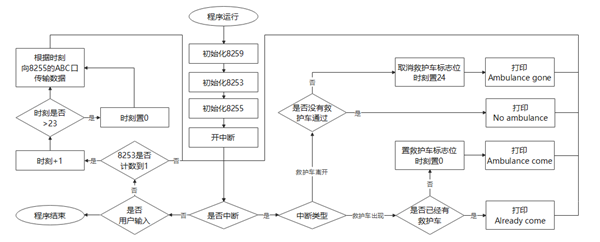
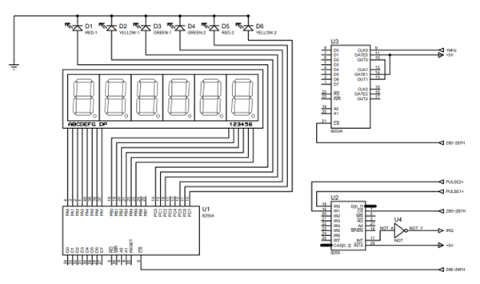
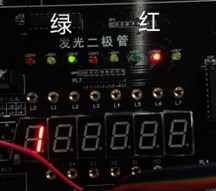
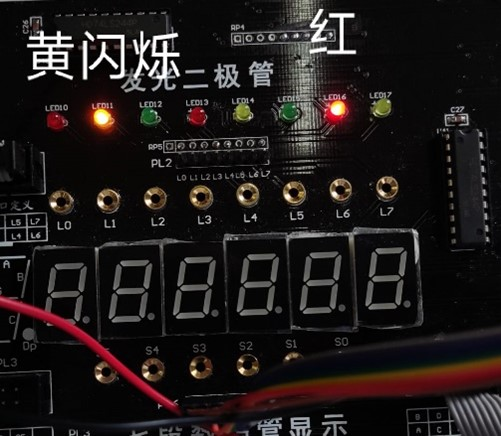
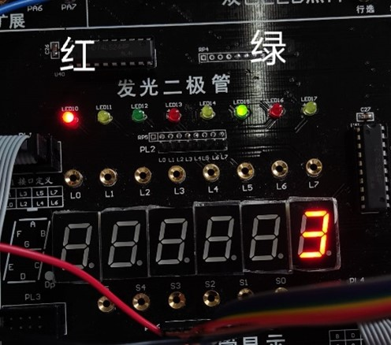
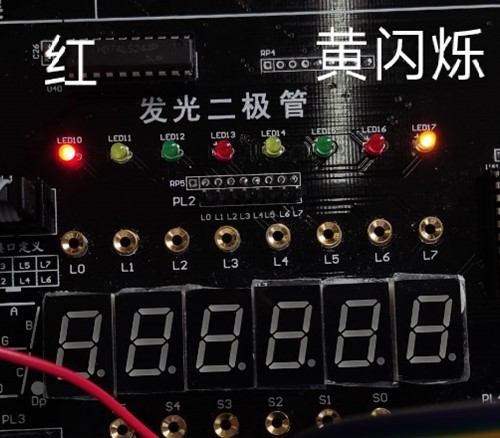
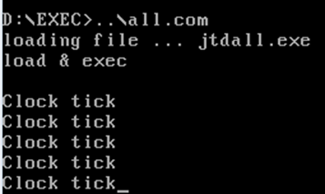
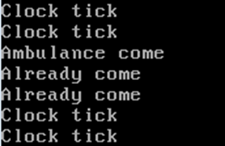
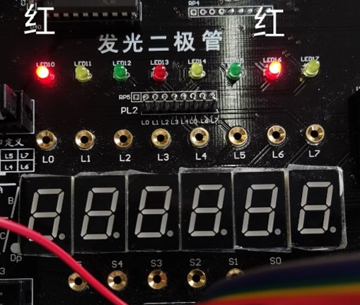
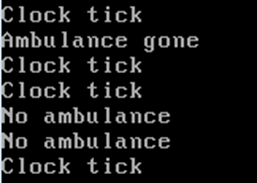

# 十字路口交通灯控制器

本课程为计算机科学与技术专业《微机原理与接口技术》，实验时间为2022年6月4日。这个实验是当时薛老师给出的5个满分100分的题目中比较简单的一个，实现比较容易理解，代码也比较短，分享在这里。同志萌碰到奇怪问题的时候可以做个参考。

硬件连线和代码都在 [jtdall.asm](jtdall.asm) 里，已经半年了具体思路并不太记得了；这个文档是实验报告，起到一个代码解释的作用。

## 实验目的及要求

1. 使用8255， 8253 和8259等芯片实现交通灯控制器。模拟十字路口交通灯控制，显示状态分别为：①南北绿东西红，持续时间4s；②南北黄东西红，闪2次，每次闪1s；③南北红东西绿，持续时间为4s；④南北红东西黄，闪2次，每次闪1s。当南北或东西为绿灯时，七段显示管分别以秒为单位倒计时。
2. 采用2个按键实现实现救护车出现场景， 采用中断形式通知CPU。 用按键1模拟当救护车出现时，东西南北四个方向都是红灯，持续到按键2 按下，模拟救护车离开路口，此时南北开始通行。
3. 只实现交通灯基本功能得90分，实现了交通灯及救护车场景模拟功能的可得100分。

## 流程图



## 线路连接

线路连接如下，只画出了需要连线的部分：



## 代码编写

芯片地址定义：

```nasm
io8253a     equ 280h
io8253b     equ 281h
io8253c     equ 282h
io8253ctl   equ 283h
io8253ctlw  equ 76h

io8255a     equ 298h
io8255b     equ 299h
io8255c     equ 29ah
io8255ctl   equ 29bh

icw1        equ 2b0h
icw2        equ 2b1h
icw3        equ 2b1h
icw4        equ 2b1h
ocw1        equ 2b1h
ocw2        equ 2b0h
ocw3        equ 2b0h
```

初始化8259：

```nasm
mov ax, cs
mov ds, ax
mov dx, offset int3
mov ax, 250bh
int 21h
cli
in al, 21h
and al, 0f7h
out 21h, al
mov al, 11h
mov dx, icw1
out dx, al 
mov al, 08h
mov dx, icw2
out dx, al
mov al, 01h
mov dx, icw4
out dx, al
mov al, 00h
mov dx, ocw1
out dx, al
mov cx, 0fffh
```

初始化8253，将的通道0初始化为工作方式3方波发生器，由于初值为50000，时钟为1MHz，故产生20Hz的方波信号；通道1初始化为工作方式2计数器，初值为10，时钟接通道0输出，故为0.5s一周期的计数器，当轮询到其计数为1时即为0.5s：

```nasm
mov dx, seg data
mov ds, dx
mov dx, seg stk
mov ss, dx

;初始化8253
mov dx, io8253ctl
mov al, 00110110b   ; 通道0工作方式3 初值50000
out dx, al
mov dx, io8253a
mov ax, 50000
out dx, al
mov al, ah
out dx, al
mov dx, io8253ctl
mov al, 01010100b   ; 通道1工作方式2 初值10 只读写低8位
out dx, al
mov dx, io8253b
mov al, 10
out dx, al
```

初始化8255，将其ABC口均设置为输出。其中A口作为数码管的段选信号，控制显示倒计时；B口作为数码管的位选信号，控制显示哪一侧的倒计时；C口作为LED的控制信号，显示两侧信号灯情况：

```nasm
mov dx,io8255ctl    ;将8255设为A B C口输出
mov al,80h
out dx,al
mov dx, io8255a
mov al, 0
out dx, al
mov dx, io8255c
out dx, al          ;关显示
```

开中断，用于接受用户输入，提示救护车来临：

```nasm
sti ; 开中断
```

获取8253时间子程序，从8253的通道1获取计数器值，到达1时为0.5s：

```nasm
getclk proc near
    ; 读8253b入al
    push dx
    mov dx, io8253b
    in al, dx
    pop dx
    ret
getclk endp
```

从键盘获取输入子程序，用于获取用户键盘输入，有输入则退出程序：

```nasm
readkey proc neer 
    push dx
    mov ah, 06h
    mov dl, 0ffh
    int 21h
    pop dx
    ret
readkey endp
```

大循环，通过轮询方式得到当前时刻，并根据时刻变化切换交通灯和数码管的显示：

```nasm
bigloop:
    ; 获取时间 0.5s 触发一次
    call getclk
    dec al
    test al, 255
    jnz nowork

    mov al, byte ptr clk
    test al, 255
    jnz oldsec

    mov dx, offset msgclk
    mov ah, 09h
    int 21h
    ; 防止触发多次
    mov byte ptr clk, 1

    ; 数码管和LED
    xor ax, ax

    mov si,offset dpos
    mov al, byte ptr time
    add si, ax
    mov al, byte ptr [si]
    mov dx, io8255b
    out dx, al
    mov si,offset digits
    mov al, byte ptr time
    add si, ax
    mov al, byte ptr [si]
    mov dx, io8255a
    out dx, al

    mov si,offset led
    mov al, byte ptr time
    add si, ax
    mov al, byte ptr [si]
    mov dx, io8255c
    out dx, al

    ; 是否救护车情况
    test byte ptr ambu, 255
    jnz incircle

    ; 时间++
    inc byte ptr time
    cmp byte ptr time, 24
    jb incircle
    mov byte ptr time, 0

incircle:
    jmp oldsec
nowork:
    mov byte ptr clk, 0
oldsec:
    call readkey
    jnz quit
    call delay100ms
    jmp bigloop
```

中断处理子程序，当中断触发时，判断是哪个中断产生，并判断用户按键事件的合法性，如果合法则触发事件，不合法则打印相应信息：

```nasm
int3:
    cli ;关中断
    mov dx, ocw3
    mov al, 0ah
    out dx, al
    in al, dx
    mov byte ptr intnum, al
    cmp al, 00h
    jz iend
    and al, 03h
    test al, 01h
    jnz itr0
    test al, 02h
    jnz itr1
    jmp iend
itr0:
    mov ax, seg data
    mov ds, ax
    test byte ptr ambu, 255 ; 如果已经在救护车状态则显示已经来到
    jnz hasemb
    mov dx, offset msgint0
    mov ah, 09h
    int 21h
    mov byte ptr ambu, 1
    mov byte ptr time, 24
    jmp enditr0
hasemb:
    mov dx, offset msgint2
    mov ah, 09h
    int 21h
enditr0:
    mov al, intnum
    test al, 02h
    jnz itr1
    jmp iend
itr1:
    mov ax, seg data
    mov ds, ax
    test byte ptr ambu, 255 ; 如果并不在救护车状态则显示无救护车
    jz noemb
    mov dx, offset msgint1
    mov ah, 09h
    int 21h
    mov byte ptr ambu, 0
    mov byte ptr time, 0
    jmp iend
noemb:
    mov dx, offset msgint3
    mov ah, 09h
    int 21h
iend:
    mov al, 20h
    out 20h, al
    jmp next
    in al, 21h
    or al, 08h
    out 21h, al
    ;mov ah, 4ch
    ;int 21h
next:
    sti
    iret    ; 中断返回
```

## 实验结果与数据处理

首先发光二极管分四种状态循环切换,最左三个LED和数码管代表南北，最右三个LED和数码管代表东西，图中数码管亮的状态下均从4开始倒计时。四个图持续时间分别为4s、2s（闪烁两次，周期1s）、4s、2s（闪烁两次，周期1s）：






此时终端显示时钟触发，正常时0.5s打印一次：



当PULSE2+按下时，含义为救护车来到，终端打印Ambulance come，LED信号灯两侧均为红灯。若在此时重复按下按钮，由于已经在“救护车”状态，则会打印Already come：




当PULSE1+按下时，含义为救护车离开，终端打印Ambulance gone，LED信号灯和数码管重置到南北绿灯东西红灯的状态，且数码管从4开始倒计时。若在此时重复按下按钮，由于并不在 “救护车”状态，则会打印No ambulance：



